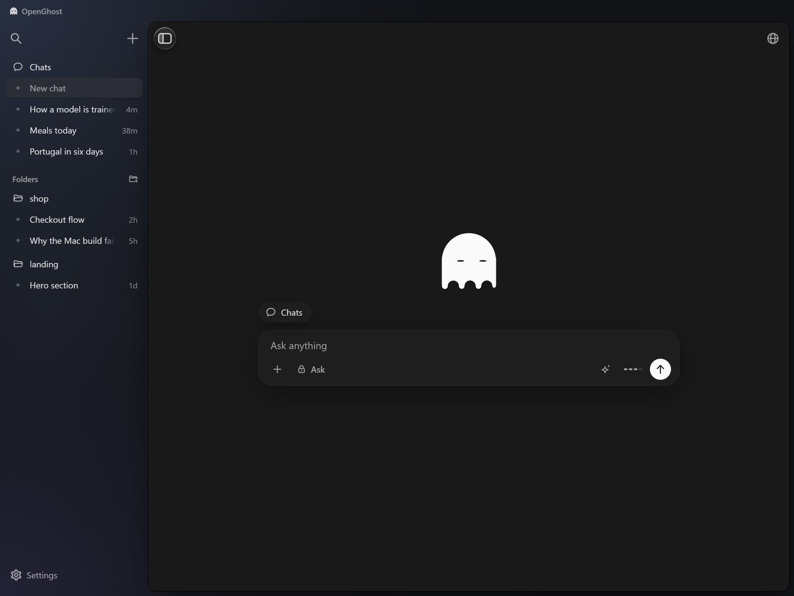
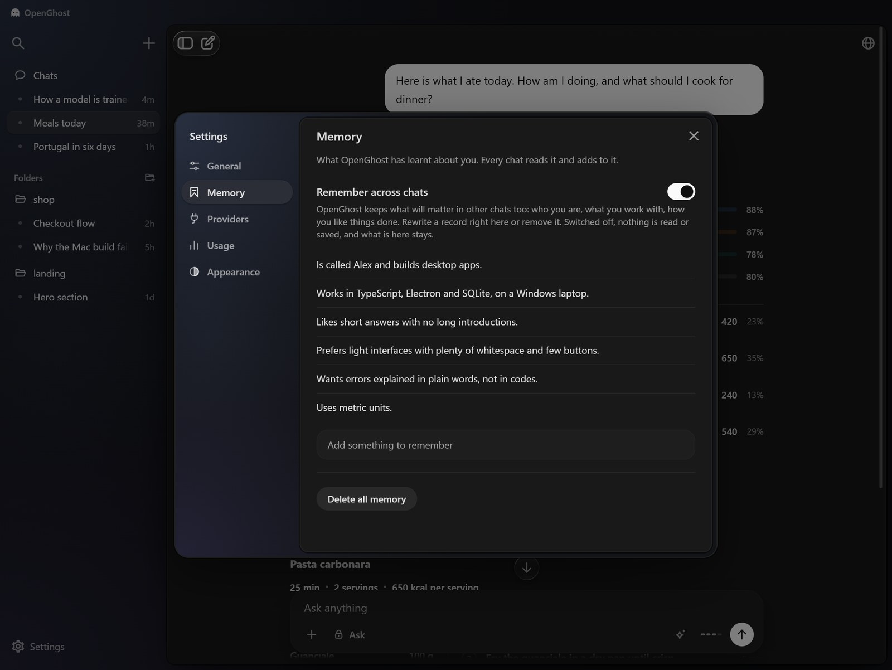
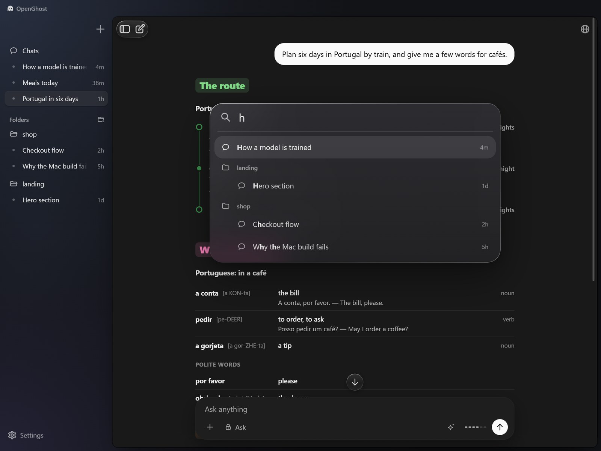
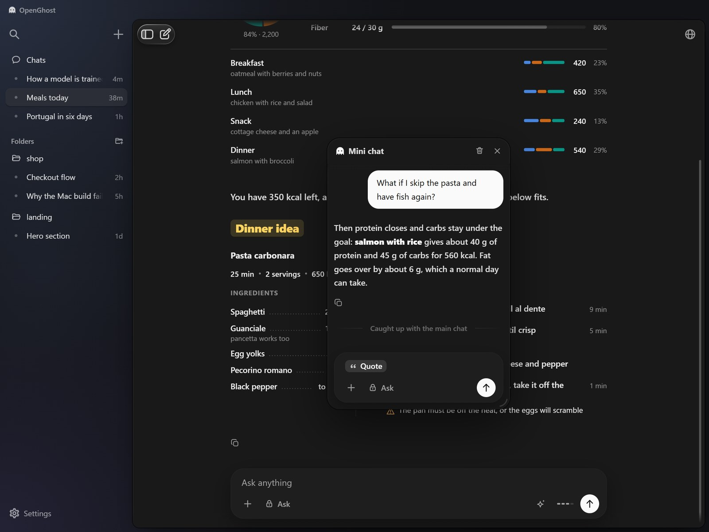
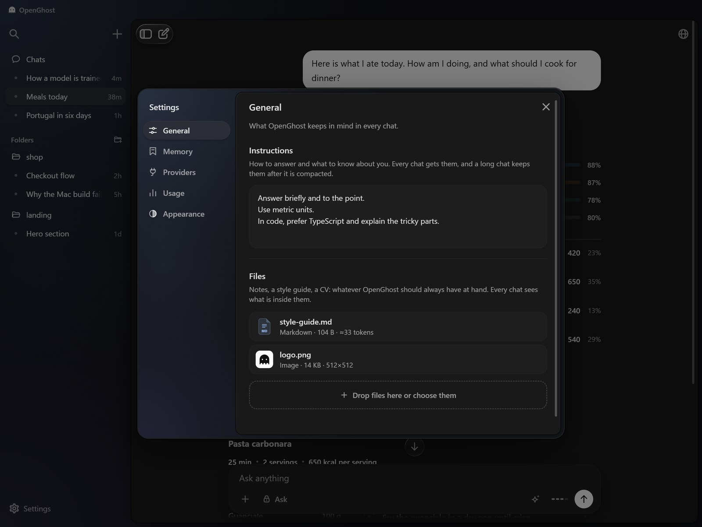
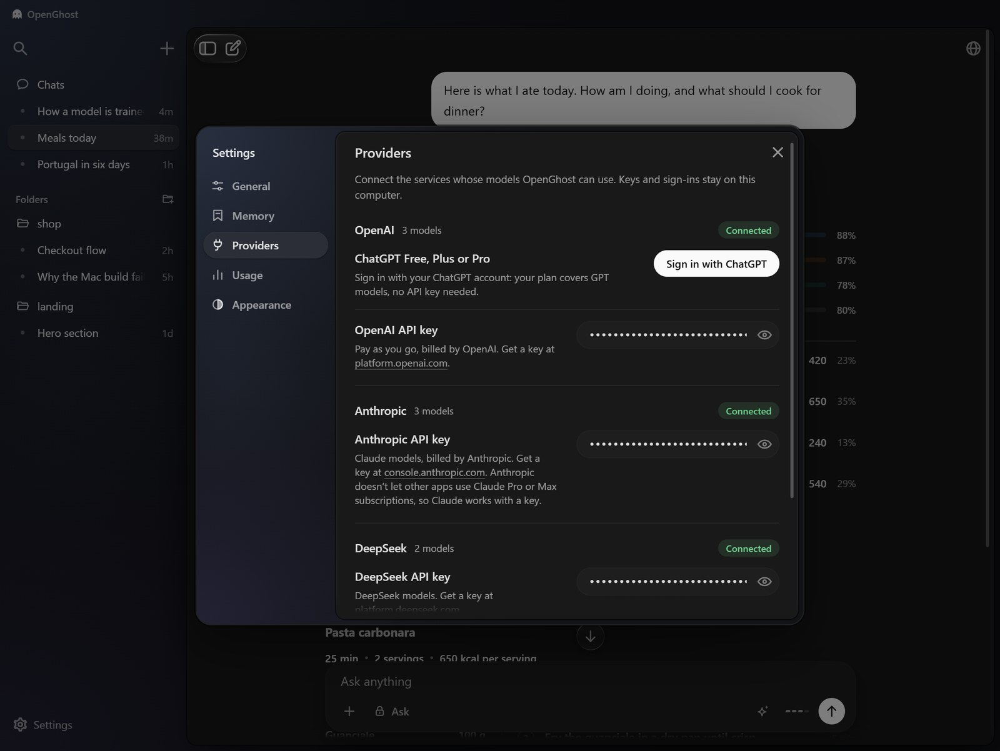

# OpenGhost

[](https://discord.gg/6cKd2UND5)

**v1.4.0 beta**

[Windows version 1.4.0](https://github.com/ANDRETRIPOL/OpenGhost/releases/download/v1.4.0/OpenGhost-1.4.0-Setup.exe)

[Linux version 1.4.0](https://github.com/ANDRETRIPOL/OpenGhost/releases/download/v1.4.0/OpenGhost-1.4.0-linux.tar.gz)

[macOS version 1.4.0](https://github.com/ANDRETRIPOL/OpenGhost/releases/download/v1.4.0/OpenGhost-1.4.0-mac.dmg)

What's new:
- Memory. OpenGhost remembers who you are and how you like things done, and every chat knows it. You read, rewrite and remove the records in Settings, under Memory, or switch it off.
- AGENTS.md. A project's own instructions are read from its folder, and "remember this for the project" writes them there.
- A new search. The magnifier, or Ctrl+K, opens a glass panel in the middle of the chat, with the chats it finds under their folders.
- Two agents at once. Mini chat now floats, can be dragged and resized, and its agent works alongside the chat's own: each has its own browser tab, they know of each other and never change the same file. A mini chat closed at work goes on working.
- OpenRouter, with its hundreds of models, sorted by company in the model picker.
- Notes beside a chat, which the agent reads and brings up when their moment comes.
- PDFs are read by sight: pages with photos, charts, formulas and scans go to the model as pictures.
- Drafts stay in their own chats and outlive a restart. A chat answered while you were elsewhere gets a blue dot.
- A message sent while the agent works waits in a dashed outline and can be taken back. A long sent message folds to twelve lines.
- After a long chat is compacted, the agent keeps its last steps word for word and goes on by itself.
- Photos open large, and the interface sizes itself to the screen, from a laptop to 5K.
- Browser fixes: a step stops on Stop and on Take control, and a tab no longer hangs.

Older versions are on the [Releases](https://github.com/ANDRETRIPOL/OpenGhost/releases) page.

The code is under the MIT license. The name OpenGhost, the ghost logo, the animations, and the visual design are not: they stay with the author. A modified version may not be published or distributed with any of them, paid or free, and they may not be used for any commercial purpose. See LICENSE.

OpenGhost is an open desktop agent for Windows, macOS and Linux. It runs commands, edits files, keeps git and works on the web in a browser of its own. And it shows what it explains: charts, schemes, photos and videos stand next to the text.

## Written from scratch

Nothing in OpenGhost is assembled from ready parts. There is no UI framework inside, no Markdown library, no Mermaid, no chart library and no agent framework. Every part is our own code:

- **The agent.** The loop, the tools (commands, files, git, web search, pages, PDFs, video frames), the approval cards and the three permission modes.
- **The drawing engine.** It reads what a model writes, lays it out and draws it: 43 kinds of drawings, from flowcharts and loss curves to a day of meals and the route of a trip. A drawing is live: it answers the pointer and can be edited where it stands.
- **The browser.** The agent sees a page as text with numbered elements, moves its own cursor, clicks, types and reads, in a browser panel it shares with you.
- **The text.** The Markdown renderer that draws a reply while it is still being written, the code highlighter and the math.
- **The interface.** Every control, its motion and its glass, in plain JavaScript and CSS.

The app stands on two things only: Electron, which gives it a window, and Anthropic's official SDK, which talks to Claude.

## It shows what it explains

Ask how something works, and the answer comes with drawings: the whole as a scheme, the curves the topic is known for as charts, the key numbers as tiles. Here three training runs stand on one chart: a healthy one, one that blows up and one that barely moves.


## A scheme with the detail in it

A block carries its name and a line about what happens in it. Stages stand in groups, and a process that repeats closes into a ring.


## Drawings made for the subject

Food, recipes, documents, matches, languages, PC builds, device settings and trips have drawings of their own. A day of meals is a ring of calories with protein, fat and carbs against the goal.


A trip is a route with its legs, and words to learn come with their sound and an example.


## Change the drawing where it stands

A drawing is not a finished picture. Open it and change the layout, the blocks and the arrows in a table, or edit its source. The drawing follows as you type.


## Photos and videos in the reply

When a thing is better seen than described, a dish, a place, a game, the agent looks for pictures and videos itself. Pictures stand in a stack to leaf through, each with the page it came from. A video is a card with its preview, name and length, and a click opens it in your browser.

## A browser with its own cursor

OpenGhost has a built-in browser and drives it itself. It opens a page, moves its own cursor, clicks, types, and sees what is on the screen. The panel sits on the right of the chat. Close it and the agent still works.


## Start with a question, not with a folder

A new chat needs no folder. Type, and it goes to Chats at the top of the list, with a folder of its own for the files the agent makes. A chat about a project still lives in that project's folder.



## It remembers you

Tell OpenGhost about yourself once, in any chat, and every chat knows it: who you are, what you work with, how you like answers. It keeps short records, changes a record when the thing changes instead of writing a second one, and never keeps passwords or the details of one task. Everything it remembers is on one page of the settings, where you can rewrite a record, remove it, add your own, or switch the memory off.



A project can have its own instructions too: put an AGENTS.md in its folder, and the agent working there follows it.

## Find a chat

The magnifier, or Ctrl+K, opens a search in the middle of the chat. Type, and the chats it finds come out under it, each under its folder.



## Mini chat, with an agent of its own

Select a passage and open Mini chat over the conversation. It floats: drag it by its head, pull the arc in its corner to resize it, and keep writing in the chat behind it. Its agent has the current chat as context and works alongside the chat's own agent, in its own browser tab; the two know of each other and never change the same file. Close a mini chat at work and it goes on working.



## What a chat costs

Chat stats, in the plus menu, show what a chat has spent: the tokens of every reply, the share of each model, how much of it came from the cache and how full the context is. Compact chat, next to it, frees the context of a long conversation, and the app does the same by itself before the model's window fills.


## Show it a photo, a video, a PDF

Photos, videos and files attach from the plus menu or by a drop. A video comes in like a photo, and the agent watches it frame by frame. A PDF is read as text, and its pages with photos, charts, formulas or scans are looked at as pictures.

## Tell it once, for every chat

In Settings, under General, you write how to answer and what to know about you, and add the files OpenGhost should always have at hand: notes, a style guide, a CV. Every chat gets them, and a long chat keeps them after it is compacted.



## Three ways to let it act

Ask waits for approval before commands, file changes, and the web. Auto works inside the project folder and asks before a risky step. Full access does not ask.


## The key stays on this computer

OpenGhost works with ChatGPT, OpenAI, Claude, DeepSeek, OpenRouter and OpenCode Go: sign in with your ChatGPT account, or connect OpenAI, Claude, DeepSeek, OpenRouter and OpenCode Go with an API key. Keys and sign-ins are stored only on your machine, encrypted by the operating system, and the list of models comes from each provider itself. Any chat can also be locked with a password: it is real encryption on your computer, not a lock screen.



## It opens with the ghost

The app starts on its own screen. The ghost flies in through the mist, then the name OpenGhost appears.


## Build it yourself

The same code runs on Windows, macOS and Linux. You need Node.js 22 or newer.

```
npm ci
npm start
```

`npm start` runs the app straight from the code. To make an installer, run the command for your system on that system:

- Windows: `npm run dist` makes `dist/OpenGhost-<version>-Setup.exe`
- macOS: `npm run dist:mac` makes `dist/OpenGhost-<version>-mac.dmg`
- Linux: `npm run dist:linux` makes `dist/OpenGhost-<version>-linux.tar.gz`

No Mac or Linux machine at hand? A fork can build both on GitHub: turn on Actions, open Build and press Run workflow. The files appear on the page of that run.

## Support the project

OpenGhost is free. Testing it on real models costs money for every release, and sponsorship pays for exactly that: API time and the work on new versions. If the app is useful to you, you can [sponsor it on GitHub](https://github.com/sponsors/ANDRETRIPOL).

## Thanks

[@kodachromez](https://github.com/kodachromez) found eight real bugs in a single report, and [@Bruno8R](https://github.com/Bruno8R) noticed that API keys were kept in plain text. All of it is fixed in v1.2.0. @kodachromez then went through 1.3.0 and found where the browser could not be stopped and where a tab hung: fixed in v1.4.0. Thank you both.
